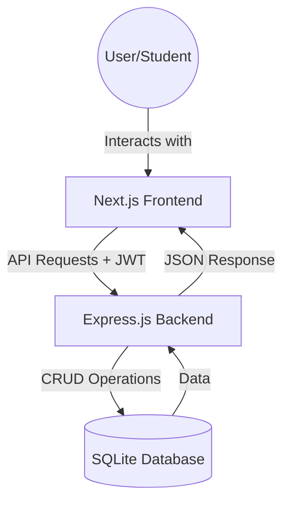

#  TaskFlow: Advanced Task Management System

Welcome to **TaskFlow**! This is a full-stack web application designed to help users organize their daily tasks efficiently. 

This project was built using a modern **MERN-like stack** (using Next.js and SQL instead of MongoDB) to demonstrate professional software development practices, including **Layered Architecture**, **JWT Authentication**, and **Responsive UI Design**.

---

##  System Architecture

To understand how TaskFlow works, we can look at it in three main parts: the **Frontend**, the **Backend**, and the **Database**.

### 1. Frontend (The User Interface)
- **Next.js 15**: A powerful React framework that handles orphaning and routing.
- **Framer Motion**: Used for smooth, professional animations (tasks slide in and out nicely!).
- **Context API**: Acts like a "global memory" for the app, remembering if a user is logged in.

### 2. Backend (The Brain)
- **Express.js**: Our web server that listens for requests from the frontend.
- **Layered Pattern**: We split our code into **Routes**, **Controllers**, and **Services**. This is like a restaurant:
    - **Routes**: The Menu (what you can ask for).
    - **Controllers**: The Waiter (takes your order and gives you the food).
    - **Services**: The Chef (does all the complex cooking logic).

### 3. Database (The Memory)
- **Prisma ORM**: A tool that lets us talk to our database using JavaScript instead of complex SQL queries.
- **SQLite**: A lightweight database file that stores all our users and tasks securely.

---

##  How It Works (Walkthrough)

### Step 1: Secure Entry (Authentication)
Users must first **Register** and **Login**. 
- We use **JWT (JSON Web Tokens)** to keep you logged in.
- Your password is encrypted using **Bcrypt**, so even the database administrator can't see it!

### Step 2: The Dashboard
Once logged in, you see your personal workspace.
- **Analytics Bar**: Shows your "Efficiency" (percentage of tasks completed) and "Critical Path" (high-priority tasks).
- **Search & Filter**: Quickly find tasks by typing their name or filtering by "Pending" or "Completed".

### Step 3: Managing Tasks
- **Creating**: Add a title, description, and priority (Low, Medium, High).
- **Updating**: Need to change something? Just click the edit icon.
- **Toggling**: Click the checkbox to mark a task as "Processed". It will fade out and move down common for finished work.
- **Deleting**: Permanently remove old objectives.

---

##  Techniques & Methods 

###  JWT (JSON Web Tokens)
Instead of the server remembering every user, it gives the user a "Digital ID Card" (the token). The user shows this card every time they want to see their tasks. It's like a hall pass in college!

###  Middleware
Middleware is like a security guard. Before a request reaches the "Chef" (Service), the "Security Guard" (Middleware) checks if the user has a valid ID card.

###  CRUD Operations
This is the heart of most apps:
- **C**reate: Adding a new task.
- **R**ead: Viewing your task list.
- **U**pdate: Changing a task's details.
- **D**elete: Removing a task.

---

##  Getting Started 

### Backend Setup
1. `cd backend`
2. `npm install`
3. `cp .env.example .env` (Set your secrets!)
4. `npx prisma db push` (Setup the database)
5. `npm run dev`

### Frontend Setup
1. `cd frontend`
2. `npm install`
3. `npm run dev`

---

---

*Project developed as part of a Full-Stack Web Development assessment.*
